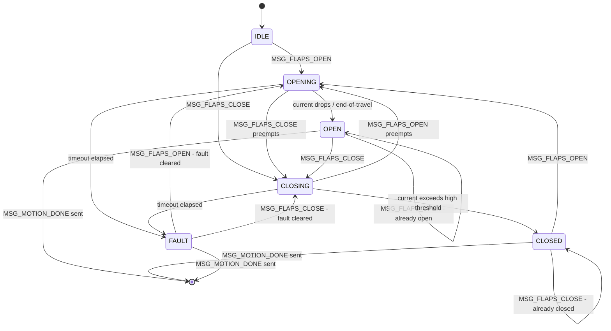
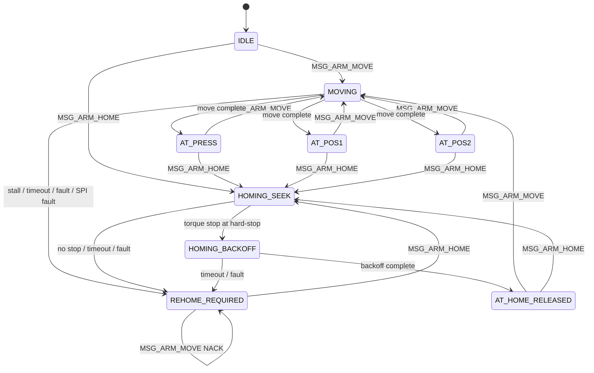
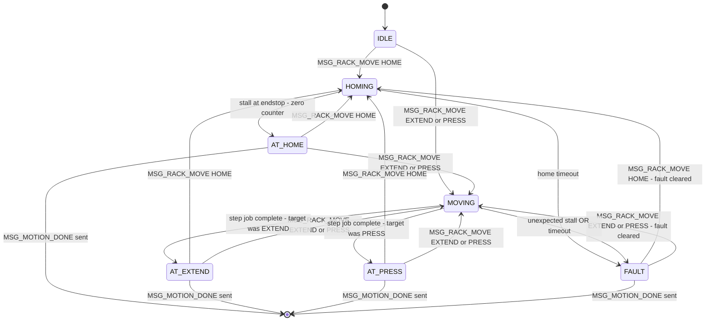
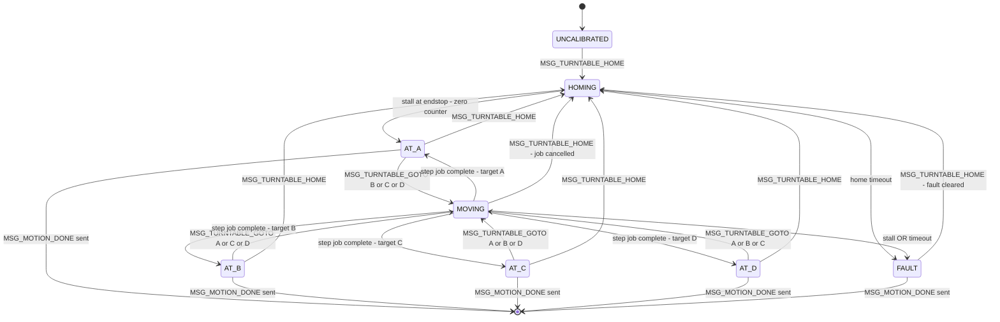
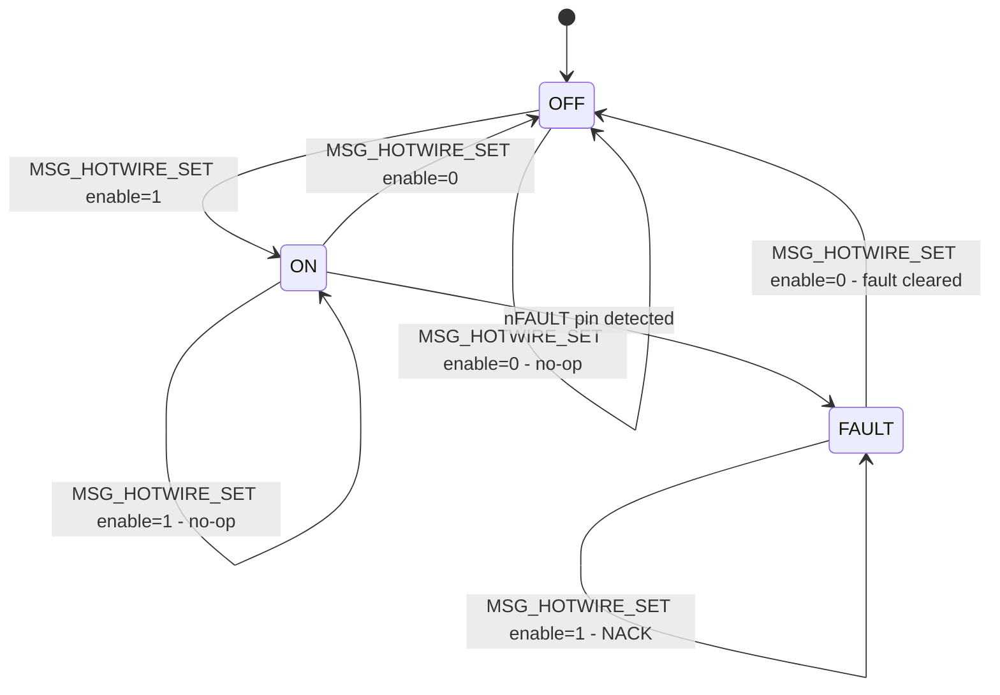
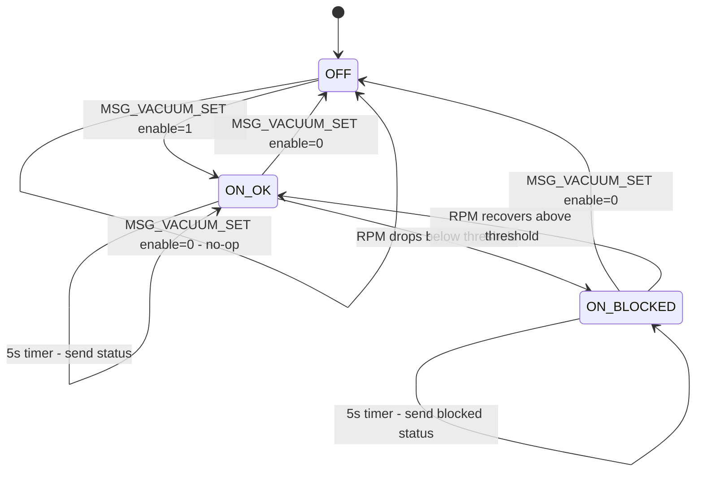

# State-Based Command Architecture Design
## ESP32 + Raspberry Pi Pico — UART/COBS/Proto Command System

**Project:** Seacoast MQP Software  
**Revision:** 1.0  
**Date:** 2026-02-18  
**Status:** Design — awaiting implementation

---

## Table of Contents

1. [New Message Type Table](#1-new-message-type-table)
2. [Payload Struct Definitions](#2-payload-struct-definitions)
3. [Pico-Side State Machines](#3-pico-side-state-machines)
4. [Position Constants](#4-position-constants)
5. [Board Pin Additions](#5-board-pin-additions)
6. [ESP32 UI Screen Layout](#6-esp32-ui-screen-layout)
7. [pico_link Helper Function Signatures](#7-pico_link-helper-function-signatures)
8. [Completion Notification Strategy](#8-completion-notification-strategy)
9. [Vacuum RPM Monitoring Strategy](#9-vacuum-rpm-monitoring-strategy)
10. [Migration Notes](#10-migration-notes)

---

## System Context

```
┌─────────────────────────────────────────────────────────┐
│  ESP32-C6  (FreeRTOS / IDF)                             │
│  ┌─────────────┐  ┌──────────────┐  ┌───────────────┐  │
│  │  LVGL UI    │  │  pico_link   │  │  motor_hal    │  │
│  │ ui_screens.c│─▶│  pico_link.c │◀─│ motor_hal_    │  │
│  │             │  │  (UART+COBS) │  │ pico.c        │  │
│  └─────────────┘  └──────┬───────┘  └───────────────┘  │
└─────────────────────────────────────────────────────────┘
                            │ UART0  115200 baud
                            │ COBS + CRC-16 framing
                            │
┌─────────────────────────────────────────────────────────┐
│  Raspberry Pi Pico  (bare-metal polling loop)           │
│  ┌─────────────┐  ┌──────────────┐  ┌───────────────┐  │
│  │ uart_server │  │ Subsystem SMs│  │  Drivers      │  │
│  │ .c (dispatch│─▶│ (flap, arm,  │─▶│ drv8263.c     │  │
│  │  + send)    │  │  rack, tt,   │  │ drv8434s.c    │  │
│  └─────────────┘  │  hotwire,    │  │ GPIO/ADC      │  │
│                   │  vacuum)     │  └───────────────┘  │
│                   └──────────────┘                      │
└─────────────────────────────────────────────────────────┘
```

**Wire format (unchanged):**  
`[COBS-encoded( proto_hdr_t | payload | CRC-16-CCITT )] 0x00`

All multi-byte fields are **little-endian** (native on both RP2040 and ESP32-C6).

---

## 1. New Message Type Table

All new command messages use IDs in the range **0x40–0x5F**.  
The unsolicited completion message uses **0x60**.  
Existing IDs (0x01, 0x10–0x11, 0x20–0x21, 0x28–0x29, 0x30–0x33, 0x80–0x81) are **unchanged**.

### 1.1 Command Messages (ESP32 → Pico)

| ID   | Constant Name              | Direction    | Payload Struct              | Description |
|------|----------------------------|--------------|-----------------------------|-------------|
| 0x40 | `MSG_FLAPS_OPEN`            | ESP → Pico   | _(none, len=0)_             | Open both flaps — drive DRV8263 flap instance FORWARD at full speed with current-drop auto-stop |
| 0x41 | `MSG_FLAPS_CLOSE`           | ESP → Pico   | _(none, len=0)_             | Close both flaps — drive DRV8263 flap instance REVERSE with current-high auto-stop at mechanical stop |
| 0x42 | `MSG_ARM_MOVE`             | ESP → Pico   | `pl_arm_move_t`             | Move arm stepper (DRV8434S dev 0) to named absolute position |
| 0x43 | `MSG_RACK_MOVE`            | ESP → Pico   | `pl_rack_move_t`            | Move rack stepper (DRV8434S dev 1) to named absolute position; HOME also zeros position counter |
| 0x44 | `MSG_TURNTABLE_GOTO`       | ESP → Pico   | `pl_turntable_goto_t`       | Move turntable stepper (DRV8434S dev 2) to named absolute angular position |
| 0x45 | `MSG_TURNTABLE_HOME`       | ESP → Pico   | _(none, len=0)_             | Drive turntable to physical endstop via stall detection; zero position counter |
| 0x46 | `MSG_HOTWIRE_SET`          | ESP → Pico   | `pl_hotwire_set_t`          | Enable or disable hot-wire PWM (DRV8263 hotwire instance, constant current mode) |
| 0x47 | `MSG_VACUUM_SET`           | ESP → Pico   | `pl_vacuum_set_t`           | Assert or de-assert vacuum pump trigger GPIO |
| 0x4D | `MSG_ARM_HOME`             | ESP → Pico   | _(none, len=0)_             | Sensorlessly home the arm against its positive hard stop, then back off |

### 1.2 Unsolicited Status Messages (Pico → ESP32)

| ID   | Constant Name              | Direction    | Payload Struct              | Description |
|------|----------------------------|--------------|-----------------------------|-------------|
| 0x48 | `MSG_VACUUM_STATUS`        | Pico → ESP   | `pl_vacuum_status_t`        | Unsolicited vacuum RPM status; sent on state change and periodically every 5 s while pump is on |
| 0x60 | `MSG_MOTION_DONE`          | Pico → ESP   | `pl_motion_done_t`          | Unsolicited motion-complete notification for any stepper or flap subsystem |

> **Acknowledgement policy:** Every ESP→Pico command receives an immediate `MSG_ACK` (0x80) or `MSG_NACK` (0x81) from the Pico's `dispatch_decoded()` once the command is validated and the subsystem state machine transition is accepted. `MSG_MOTION_DONE` is sent **later**, asynchronously, when the physical motion completes or faults.

---

## 2. Payload Struct Definitions

All structs are C99-compatible, `__attribute__((packed))`, and use only fixed-width integer types from `<stdint.h>`. Add the following to `shared/proto/proto.h` in the existing block of `typedef struct` definitions.

```c
/* ── New Enum Types ─────────────────────────────────────────────────────── */

/* Subsystem IDs used in pl_motion_done_t */
typedef enum __attribute__((packed))
{
    SUBSYS_FLAPS      = 0,
    SUBSYS_ARM        = 1,
    SUBSYS_RACK       = 2,
    SUBSYS_TURNTABLE  = 3,
} subsystem_id_t;

/* Motion result codes used in pl_motion_done_t */
typedef enum __attribute__((packed))
{
    MOTION_OK             = 0,   /* Completed normally (reached target steps) */
    MOTION_STALLED        = 1,   /* Stepper stall detected before target */
    MOTION_TIMEOUT        = 2,   /* Wall-clock timeout elapsed */
    MOTION_FAULT          = 3,   /* Driver fault pin asserted */
    MOTION_SPI_FAULT      = 4,   /* SPI communication failure (not a physical stall) */
} motion_result_t;

/* Arm absolute position identifiers */
typedef enum __attribute__((packed))
{
    ARM_POS_PRESS = 0,
    ARM_POS_1     = 1,
    ARM_POS_2     = 2,
} arm_pos_t;

/* Rack absolute position identifiers */
typedef enum __attribute__((packed))
{
    RACK_POS_HOME   = 0,
    RACK_POS_EXTEND = 1,
    RACK_POS_PRESS  = 2,
} rack_pos_t;

/* Turntable absolute position identifiers */
typedef enum __attribute__((packed))
{
    TURNTABLE_POS_A = 0,
    TURNTABLE_POS_B = 1,
    TURNTABLE_POS_C = 2,
    TURNTABLE_POS_D = 3,
} turntable_pos_t;

/* Vacuum operational status */
typedef enum __attribute__((packed))
{
    VACUUM_OK      = 0,
    VACUUM_BLOCKED = 1,
} vacuum_status_code_t;

/* ── New Message Payload Structs ────────────────────────────────────────── */

/*
 * MSG_ARM_MOVE (0x42)  ESP→Pico   1 byte
 * Move arm stepper (DRV8434S dev 0) to a named absolute position.
 */
typedef struct __attribute__((packed))
{
    uint8_t position; /* arm_pos_t */
} pl_arm_move_t;

/*
 * MSG_RACK_MOVE (0x43)  ESP→Pico   1 byte
 * Move rack stepper (DRV8434S dev 1) to a named absolute position.
 * RACK_POS_HOME additionally zeros the Pico's internal step counter.
 */
typedef struct __attribute__((packed))
{
    uint8_t position; /* rack_pos_t */
} pl_rack_move_t;

/*
 * MSG_TURNTABLE_GOTO (0x44)  ESP→Pico   1 byte
 * Rotate turntable stepper (DRV8434S dev 2) to a named angular position.
 */
typedef struct __attribute__((packed))
{
    uint8_t position; /* turntable_pos_t */
} pl_turntable_goto_t;

/*
 * MSG_HOTWIRE_SET (0x46)  ESP→Pico   1 byte
 * Enable or disable hot-wire constant-current PWM output.
 */
typedef struct __attribute__((packed))
{
    uint8_t enable; /* 1 = on (run at HOTWIRE_CURRENT_DUTY), 0 = off (coast) */
} pl_hotwire_set_t;

/*
 * MSG_VACUUM_SET (0x47)  ESP→Pico   1 byte
 * Assert or de-assert the vacuum pump trigger GPIO.
 */
typedef struct __attribute__((packed))
{
    uint8_t enable; /* 1 = pump on (trigger HIGH), 0 = pump off (trigger LOW) */
} pl_vacuum_set_t;

/*
 * MSG_VACUUM_STATUS (0x48)  Pico→ESP (unsolicited)   4 bytes
 * Reports current vacuum pump RPM and blocked/OK status.
 */
typedef struct __attribute__((packed))
{
    uint8_t  status;   /* vacuum_status_code_t */
    uint8_t  _rsvd;    /* padding — must be 0x00 */
    uint16_t rpm;      /* measured RPM (0 if pump is off) */
} pl_vacuum_status_t;

/*
 * MSG_MOTION_DONE (0x60)  Pico→ESP (unsolicited)   8 bytes
 * Sent when any actuator subsystem reaches a terminal state.
 * steps_done is signed: positive = forward, negative = reverse.
 */
typedef struct __attribute__((packed))
{
    uint8_t  subsystem;   /* subsystem_id_t */
    uint8_t  result;      /* motion_result_t */
    uint8_t  _rsvd[2];   /* padding — must be 0x00 0x00 */
    int32_t  steps_done;  /* actual steps completed (meaningless for SUBSYS_FLAPS) */
} pl_motion_done_t;
```

### 2.1 Size Summary

| Struct                | Size (bytes) | Notes |
|-----------------------|:------------:|-------|
| `pl_arm_move_t`       | 1            | |
| `pl_rack_move_t`      | 1            | |
| `pl_turntable_goto_t` | 1            | |
| `pl_hotwire_set_t`    | 1            | |
| `pl_vacuum_set_t`     | 1            | |
| `pl_vacuum_status_t`  | 4            | status + rsvd + rpm |
| `pl_motion_done_t`    | 8            | subsystem + result + 2×rsvd + steps_done |
| `MSG_FLAPS_OPEN`       | 0            | zero-length payload |
| `MSG_FLAPS_CLOSE`      | 0            | zero-length payload |
| `MSG_TURNTABLE_HOME`  | 0            | zero-length payload |

All sizes fit within `PROTO_MAX_PAYLOAD = 128`.

---

## 3. Pico-Side State Machines

The Pico runs a **bare-metal cooperative polling loop** (no RTOS). Each subsystem is a self-contained state machine polled every iteration of `main()`. State transitions occur either synchronously (on message receipt in `dispatch_decoded()`) or asynchronously (on hardware events detected in the polling loop).

When any subsystem reaches a terminal state (`*_DONE`, `*_FAULT`), it calls `send_motion_done(subsystem_id, result, steps)` which serialises `pl_motion_done_t` and transmits it to the ESP32 via `uart_send_frame()`.

**Global per-subsystem position trackers** (all `int32_t`, maintained by the Pico):

```c
static int32_t s_arm_pos_steps;        /* DRV8434S dev 0 */
static int32_t s_rack_pos_steps;       /* DRV8434S dev 1 */
static int32_t s_turntable_pos_steps;  /* DRV8434S dev 2 */
```

---

### 3.1 Flap Subsystem State Machine

**Hardware:** DRV8263 flap instance (GP20/GP21, ADC ch1 GP27).  
**Trigger messages:** `MSG_FLAPS_OPEN` (0x40), `MSG_FLAPS_CLOSE` (0x41).  
**Config constants:** `FLAP_OPEN_SPEED`, `FLAP_OPEN_LOW_TH`, `FLAP_OPEN_HIGH_TH`, `FLAP_CLOSE_SPEED`, `FLAP_CLOSE_LOW_TH`, `FLAP_CLOSE_HIGH_TH`, `FLAP_TIMEOUT_MS`.

#### State Transition Table

| From State   | Event / Condition                              | To State   | Side Effect |
|--------------|------------------------------------------------|------------|-------------|
| `IDLE`       | `MSG_FLAPS_OPEN` received                       | `OPENING`  | Start DRV8263 FWD at full speed; start timeout timer; ACK |
| `IDLE`       | `MSG_FLAPS_CLOSE` received                      | `CLOSING`  | Start DRV8263 REV; start timeout timer; ACK |
| `OPENING`    | Monitoring auto-stop fires: current drops      | `OPEN`     | Send `MSG_MOTION_DONE(SUBSYS_FLAPS, MOTION_CURRENT_STOP)` |
| `OPENING`    | `FLAP_TIMEOUT_MS` elapsed                      | `FAULT`    | Stop DRV8263; send `MSG_MOTION_DONE(SUBSYS_FLAPS, MOTION_TIMEOUT)` |
| `OPENING`    | `MSG_FLAPS_CLOSE` received                      | `CLOSING`  | Restart DRV8263 REV; reset timer; ACK |
| `OPEN`       | `MSG_FLAPS_CLOSE` received                      | `CLOSING`  | Start DRV8263 REV; start timer; ACK |
| `OPEN`       | `MSG_FLAPS_OPEN` received                       | `OPEN`     | Already open — send `MSG_MOTION_DONE(SUBSYS_FLAPS, MOTION_OK)`; ACK |
| `CLOSING`    | Monitoring auto-stop fires: current high       | `CLOSED`   | Send `MSG_MOTION_DONE(SUBSYS_FLAPS, MOTION_CURRENT_STOP)` |
| `CLOSING`    | `FLAP_TIMEOUT_MS` elapsed                      | `FAULT`    | Stop DRV8263; send `MSG_MOTION_DONE(SUBSYS_FLAPS, MOTION_TIMEOUT)` |
| `CLOSING`    | `MSG_FLAPS_OPEN` received                       | `OPENING`  | Restart DRV8263 FWD; reset timer; ACK |
| `CLOSED`     | `MSG_FLAPS_OPEN` received                       | `OPENING`  | Start DRV8263 FWD; start timer; ACK |
| `CLOSED`     | `MSG_FLAPS_CLOSE` received                      | `CLOSED`   | Already closed — send `MSG_MOTION_DONE(SUBSYS_FLAPS, MOTION_OK)`; ACK |
| `FAULT`      | `MSG_FLAPS_OPEN` received                       | `OPENING`  | Clear fault; start DRV8263 FWD; ACK |
| `FAULT`      | `MSG_FLAPS_CLOSE` received                      | `CLOSING`  | Clear fault; start DRV8263 REV; ACK |

**Auto-stop detection:** Poll `s_drv8263_flap.monitoring_enabled` each loop iteration; transition fires when it goes `false` unexpectedly (i.e., the driver's internal threshold logic stopped the motor).

#### Flap State Diagram



---

### 3.2 Arm Stepper State Machine

**Hardware:** DRV8434S device index 0, daisy-chain on SPI0.  
**Trigger messages:** `MSG_ARM_MOVE` (0x42), `MSG_ARM_HOME` (0x4D).  
**Position tracking:** `s_arm_pos_steps` — Pico computes delta from current to target and starts a DRV8434S motion job. Boot still initializes `s_arm_pos_steps = 0` for backward compatibility, but the trusted physical reference is established only by `MSG_ARM_HOME`. Named arm positions are measured from the physical home hard-stop reached by homing.

#### State Transition Table

| From State | Event / Condition | To State | Side Effect |
|------------|-------------------|----------|-------------|
| `IDLE` / `AT_PRESS` / `AT_POS1` / `AT_POS2` | `MSG_ARM_MOVE(any)` received | `MOVING` | Compute delta to `ARM_STEPS_*`; start step job; ACK |
| `IDLE` / `AT_PRESS` / `AT_POS1` / `AT_POS2` / `REHOME_REQUIRED` | `MSG_ARM_HOME` received | `HOMING_SEEK` | Require idle DRV8434S motion engine; start positive seek using `ARM_HOME_*` constants; ACK |
| `MOVING` | Step job complete | `AT_PRESS` / `AT_POS1` / `AT_POS2` | Update `s_arm_pos_steps`; send `MSG_MOTION_DONE(SUBSYS_ARM, MOTION_OK, steps)` |
| `MOVING` | Unexpected stall / timeout / driver fault / SPI fault | `REHOME_REQUIRED` | Update tracked steps, send terminal `MSG_MOTION_DONE`, set `s_arm_rehome_required = true` |
| `REHOME_REQUIRED` | `MSG_ARM_MOVE(any)` received | `REHOME_REQUIRED` | NACK until `MSG_ARM_HOME` succeeds |
| `HOMING_SEEK` | Torque stop before search distance consumed | `HOMING_BACKOFF` | Treat stop as home hard-stop; set `s_arm_pos_steps = 0`; start relative backoff by `-ARM_HOME_BACKOFF_STEPS` |
| `HOMING_SEEK` | Search completes without torque stop | `REHOME_REQUIRED` | Send `MSG_MOTION_DONE(SUBSYS_ARM, MOTION_TIMEOUT, s_arm_pos_steps)` |
| `HOMING_SEEK` / `HOMING_BACKOFF` | Timeout / driver fault / SPI fault | `REHOME_REQUIRED` | Send terminal `MSG_MOTION_DONE`; leave arm requiring re-home |
| `HOMING_BACKOFF` | Backoff completes | `AT_HOME_RELEASED` | Update `s_arm_pos_steps += steps_achieved`; send `MSG_MOTION_DONE(SUBSYS_ARM, MOTION_OK, -ARM_HOME_BACKOFF_STEPS)` |

`MSG_ARM_HOME` is explicit/manual only. Homing is exclusive across the DRV8434S chain: if any other motion job is active, the Pico NACKs the request. While homing is active, other stepper starts are also rejected.

#### Arm State Diagram



---

### 3.3 Rack Stepper State Machine

**Hardware:** DRV8434S device index 1, daisy-chain on SPI0.  
**Trigger message:** `MSG_RACK_MOVE` (0x43).  
**Position tracking:** `s_rack_pos_steps` — zeroed when `RACK_POS_HOME` completes.  
**Homing:** Drive in the home direction until stall is detected; the stall is the physical endstop.

#### State Transition Table

| From State   | Event / Condition                              | To State    | Side Effect |
|--------------|------------------------------------------------|-------------|-------------|
| `IDLE`       | `MSG_RACK_MOVE(RACK_POS_HOME)` received        | `HOMING`    | Drive full reverse until stall; ACK |
| `IDLE`       | `MSG_RACK_MOVE(RACK_POS_EXTEND)` received      | `MOVING`    | Delta to `RACK_STEPS_EXTEND`; ACK |
| `IDLE`       | `MSG_RACK_MOVE(RACK_POS_PRESS)` received       | `MOVING`    | Delta to `RACK_STEPS_PRESS`; ACK |
| `AT_HOME`    | `MSG_RACK_MOVE(any)` received                  | `HOMING` / `MOVING` | Same as IDLE |
| `AT_EXTEND`  | `MSG_RACK_MOVE(any)` received                  | `HOMING` / `MOVING` | Same as IDLE |
| `AT_PRESS`   | `MSG_RACK_MOVE(any)` received                  | `HOMING` / `MOVING` | Same as IDLE |
| `FAULT`      | `MSG_RACK_MOVE(any)` received                  | `HOMING` / `MOVING` | Clear fault; re-home recommended |
| `HOMING`     | Stall detected at endstop                      | `AT_HOME`   | Set `s_rack_pos_steps = 0`; send `MSG_MOTION_DONE(SUBSYS_RACK, MOTION_OK, 0)` |
| `HOMING`     | `RACK_HOME_TIMEOUT_MS` elapsed, no stall       | `FAULT`     | Stop; send `MSG_MOTION_DONE(SUBSYS_RACK, MOTION_TIMEOUT, steps)` |
| `MOVING`     | `drv8434s_motion_done` cb: `reason=COMPLETE`   | `AT_EXTEND` / `AT_PRESS` | Update `s_rack_pos_steps`; send `MSG_MOTION_DONE(SUBSYS_RACK, MOTION_OK, steps)` |
| `MOVING`     | Stall detected unexpectedly                    | `FAULT`     | Send `MSG_MOTION_DONE(SUBSYS_RACK, MOTION_STALLED, steps)` |
| `MOVING`     | `RACK_MOVE_TIMEOUT_MS` elapsed                 | `FAULT`     | Send `MSG_MOTION_DONE(SUBSYS_RACK, MOTION_TIMEOUT, steps)` |

#### Rack State Diagram



---

### 3.4 Turntable Stepper State Machine

**Hardware:** DRV8434S device index 2, daisy-chain on SPI0.  
**Trigger messages:** `MSG_TURNTABLE_HOME` (0x45), `MSG_TURNTABLE_GOTO` (0x44).  
**Position tracking:** `s_turntable_pos_steps` — zeroed after homing.  
**Boot requirement:** The turntable **must** receive `MSG_TURNTABLE_HOME` before any `MSG_TURNTABLE_GOTO` is valid. Commands received in `UNCALIBRATED` state are NACKed.

#### State Transition Table

| From State       | Event / Condition                              | To State        | Side Effect |
|------------------|------------------------------------------------|-----------------|-------------|
| `UNCALIBRATED`   | `MSG_TURNTABLE_HOME` received                  | `HOMING`        | Drive to physical endstop (stall); ACK |
| `UNCALIBRATED`   | `MSG_TURNTABLE_GOTO` received                  | `UNCALIBRATED`  | NACK — not yet homed |
| `HOMING`         | Stall detected at endstop                      | `AT_A`          | Set `s_turntable_pos_steps = 0`; send `MSG_MOTION_DONE(SUBSYS_TURNTABLE, MOTION_OK, 0)` |
| `HOMING`         | `TURNTABLE_HOME_TIMEOUT_MS` elapsed            | `FAULT`         | Send `MSG_MOTION_DONE(SUBSYS_TURNTABLE, MOTION_TIMEOUT, steps)` |
| `AT_A`           | `MSG_TURNTABLE_GOTO(POS_x)` received           | `MOVING`        | Delta to target; ACK |
| `AT_B`           | `MSG_TURNTABLE_GOTO(POS_x)` received           | `MOVING`        | Delta to target; ACK |
| `AT_C`           | `MSG_TURNTABLE_GOTO(POS_x)` received           | `MOVING`        | Delta to target; ACK |
| `AT_D`           | `MSG_TURNTABLE_GOTO(POS_x)` received           | `MOVING`        | Delta to target; ACK |
| `AT_x`           | `MSG_TURNTABLE_HOME` received                  | `HOMING`        | Re-home; ACK |
| `FAULT`          | `MSG_TURNTABLE_HOME` received                  | `HOMING`        | Clear fault; re-home; ACK |
| `FAULT`          | `MSG_TURNTABLE_GOTO` received                  | `FAULT`         | NACK — re-home required |
| `MOVING`         | `drv8434s_motion_done` cb: `reason=COMPLETE`   | `AT_A/B/C/D`    | Update `s_turntable_pos_steps`; send `MSG_MOTION_DONE(SUBSYS_TURNTABLE, MOTION_OK, steps)` |
| `MOVING`         | Stall detected                                 | `FAULT`         | Send `MSG_MOTION_DONE(SUBSYS_TURNTABLE, MOTION_STALLED, steps)` |
| `MOVING`         | `TURNTABLE_MOVE_TIMEOUT_MS` elapsed            | `FAULT`         | Send `MSG_MOTION_DONE(SUBSYS_TURNTABLE, MOTION_TIMEOUT, steps)` |
| `MOVING`         | `MSG_TURNTABLE_HOME` received                  | `HOMING`        | Cancel job; re-home; ACK |

#### Turntable State Diagram



---

### 3.5 Hot Wire Subsystem State Machine

**Hardware:** DRV8263 hotwire instance (GP6/GP7, ADC ch0 GP26).  
**Trigger message:** `MSG_HOTWIRE_SET` (0x46).  
**Mode:** Constant current — one direction only (forward), fixed duty cycle `HOTWIRE_CURRENT_DUTY`. No current-threshold auto-stop; the DRV8263 is configured with `high_th = 4095` (never auto-stop).

> **No `MSG_MOTION_DONE` is sent** for the hot wire — it is a steady-state output, not a positional actuator. The ACK from `dispatch_decoded()` confirms the command was accepted.

#### State Transition Table

| From State | Event / Condition              | To State | Side Effect |
|------------|--------------------------------|----------|-------------|
| `OFF`      | `MSG_HOTWIRE_SET(enable=1)`    | `ON`     | `drv8263_set_motor_control(hotwire, FWD, HOTWIRE_CURRENT_DUTY)`; ACK |
| `ON`       | `MSG_HOTWIRE_SET(enable=0)`    | `OFF`    | `drv8263_set_motor_control(hotwire, COAST, 0)`; ACK |
| `ON`       | `MSG_HOTWIRE_SET(enable=1)`    | `ON`     | No-op; ACK |
| `OFF`      | `MSG_HOTWIRE_SET(enable=0)`    | `OFF`    | No-op; ACK |
| `ON`       | Driver nFAULT pin detected     | `FAULT`  | Log error; motor coasted automatically by driver |
| `FAULT`    | `MSG_HOTWIRE_SET(enable=0)`    | `OFF`    | Clear fault latch; ACK |
| `FAULT`    | `MSG_HOTWIRE_SET(enable=1)`    | `FAULT`  | NACK — fault must be cleared first via enable=0 |

#### Hot Wire State Diagram



---

### 3.6 Vacuum Pump Subsystem State Machine

**Hardware:** Trigger GPIO GP10 (output), RPM sense GPIO GP11 (input, rising-edge interrupt).  
**Trigger messages:** `MSG_VACUUM_SET` (0x47), `MSG_VACUUM_STATUS` sent unsolicited Pico→ESP.  
**RPM Monitoring:** Active only while pump is `ON`. Sends `MSG_VACUUM_STATUS` on any transition between `ON_OK` and `ON_BLOCKED`, and every 5 s while running.

> **No `MSG_MOTION_DONE` is sent** for the vacuum pump.

#### State Transition Table

| From State    | Event / Condition                                      | To State      | Side Effect |
|---------------|--------------------------------------------------------|---------------|-------------|
| `OFF`         | `MSG_VACUUM_SET(enable=1)`                             | `ON_OK`       | `gpio_put(VACUUM_TRIGGER_GPIO, 1)`; reset RPM counter; ACK |
| `ON_OK`       | `MSG_VACUUM_SET(enable=0)`                             | `OFF`         | `gpio_put(VACUUM_TRIGGER_GPIO, 0)`; send `MSG_VACUUM_STATUS(OFF, 0)`; ACK |
| `ON_OK`       | Sampled RPM < `VACUUM_RPM_BLOCKED_THRESHOLD`           | `ON_BLOCKED`  | Send `MSG_VACUUM_STATUS(VACUUM_BLOCKED, rpm)` |
| `ON_OK`       | 5 s periodic timer fires                               | `ON_OK`       | Send `MSG_VACUUM_STATUS(VACUUM_OK, rpm)` |
| `ON_BLOCKED`  | `MSG_VACUUM_SET(enable=0)`                             | `OFF`         | `gpio_put(VACUUM_TRIGGER_GPIO, 0)`; send `MSG_VACUUM_STATUS(OFF, 0)`; ACK |
| `ON_BLOCKED`  | Sampled RPM >= `VACUUM_RPM_BLOCKED_THRESHOLD`          | `ON_OK`       | Send `MSG_VACUUM_STATUS(VACUUM_OK, rpm)` |
| `ON_BLOCKED`  | 5 s periodic timer fires                               | `ON_BLOCKED`  | Send `MSG_VACUUM_STATUS(VACUUM_BLOCKED, rpm)` |
| `OFF`         | `MSG_VACUUM_SET(enable=0)`                             | `OFF`         | No-op; ACK |
| `ON_OK`       | `MSG_VACUUM_SET(enable=1)`                             | `ON_OK`       | No-op; ACK |

#### Vacuum State Diagram



---

### 3.7 Polling Loop Integration

The Pico main loop must call the following tick functions on every iteration:

```c
/* In main() polling loop — called every ~1 ms minimum */
flap_sm_tick();        /* polls s_drv8263_flap.monitoring_enabled, timeout */
arm_sm_tick();         /* polls drv8434s_motion_is_busy(), timeout */
rack_sm_tick();        /* polls drv8434s_motion_is_busy(), timeout */
turntable_sm_tick();   /* polls drv8434s_motion_is_busy(), timeout */
vacuum_sm_tick();      /* reads s_vacuum_rpm_count every 100 ms */
```

Stepper motion is driven by an existing `repeating_timer` at the configured `step_delay_us` interval (per [`step_timer_callback()`](pico_fw/src/uart_server.c:229)).

---

## 4. Position Constants

Add to [`pico_fw/src/board_pins.h`](pico_fw/src/board_pins.h) in a new section below the existing DRV8434S block:

```c
// ============================================================
// Absolute position constants — all values in motor steps
// from each axis' home/zero position.
// THESE ARE PLACEHOLDER DEFAULTS — calibrate on real hardware.
// ============================================================

// ── Arm stepper (DRV8434S device 0) ──────────────────────────────────────────

// Steps from the physical arm home hard-stop reached by MSG_ARM_HOME to the
// press position. Successful homing then backs off by ARM_HOME_BACKOFF_STEPS,
// so working positions are often zero or negative after calibration.
#ifndef ARM_STEPS_PRESS
#define ARM_STEPS_PRESS          -3500
#endif

// Steps from arm home to intermediate position 1.
#ifndef ARM_STEPS_POS1
#define ARM_STEPS_POS1           -500
#endif

// Steps from arm home to intermediate position 2.
#ifndef ARM_STEPS_POS2
#define ARM_STEPS_POS2           -100
#endif

// Maximum positive-direction search distance for sensorless homing.
#ifndef ARM_HOME_SEARCH_STEPS
#define ARM_HOME_SEARCH_STEPS    5000
#endif

// Homing move speed and timeout.
#ifndef ARM_HOME_STEP_DELAY_US
#define ARM_HOME_STEP_DELAY_US   2000u
#endif

#ifndef ARM_HOME_TIMEOUT_MS
#define ARM_HOME_TIMEOUT_MS      15000
#endif

// Stall-detection tuning for homing.
#ifndef ARM_HOME_TORQUE_LIMIT
#define ARM_HOME_TORQUE_LIMIT    300u
#endif

#ifndef ARM_HOME_TORQUE_BLANK_STEPS
#define ARM_HOME_TORQUE_BLANK_STEPS 0u
#endif

#ifndef ARM_HOME_TORQUE_SAMPLE_DIV
#define ARM_HOME_TORQUE_SAMPLE_DIV 1u
#endif

// Fixed release distance after a successful homing stall.
#ifndef ARM_HOME_BACKOFF_STEPS
#define ARM_HOME_BACKOFF_STEPS   100
#endif

// Maximum time allowed for any normal arm move before FAULT / REHOME_REQUIRED.
#ifndef ARM_MOVE_TIMEOUT_MS
#define ARM_MOVE_TIMEOUT_MS      10000
#endif

// ── Rack stepper (DRV8434S device 1) ─────────────────────────────────────────

// Steps from home (endstop) to fully extended rack position.
#ifndef RACK_STEPS_EXTEND
#define RACK_STEPS_EXTEND        6000
#endif

// Steps from home to press-into-arm position (beyond extend).
#ifndef RACK_STEPS_PRESS
#define RACK_STEPS_PRESS         7500
#endif

// Maximum time allowed for homing move before FAULT.
#ifndef RACK_HOME_TIMEOUT_MS
#define RACK_HOME_TIMEOUT_MS     15000
#endif

// Maximum time allowed for any non-home rack move before FAULT.
#ifndef RACK_MOVE_TIMEOUT_MS
#define RACK_MOVE_TIMEOUT_MS     12000
#endif

// ── Turntable stepper (DRV8434S device 2) ────────────────────────────────────

// Steps from home (endstop / zero) to each named angular position.
#ifndef TURNTABLE_STEPS_A
#define TURNTABLE_STEPS_A        0
#endif

#ifndef TURNTABLE_STEPS_B
#define TURNTABLE_STEPS_B        1250
#endif

#ifndef TURNTABLE_STEPS_C
#define TURNTABLE_STEPS_C        2500
#endif

#ifndef TURNTABLE_STEPS_D
#define TURNTABLE_STEPS_D        3750
#endif

// Maximum time allowed for homing move before FAULT.
#ifndef TURNTABLE_HOME_TIMEOUT_MS
#define TURNTABLE_HOME_TIMEOUT_MS   20000
#endif

// Maximum time allowed for any goto move before FAULT.
#ifndef TURNTABLE_MOVE_TIMEOUT_MS
#define TURNTABLE_MOVE_TIMEOUT_MS   15000
#endif

// ── Flap actuators (DRV8263 flap instance) ───────────────────────────────────

// Maximum time to open or close flaps before FAULT.
#ifndef FLAP_TIMEOUT_MS
#define FLAP_TIMEOUT_MS          8000
#endif

// Open: full speed forward (4095 = 12-bit max), low threshold triggers stop
// when back-EMF collapses at end of travel.
#ifndef FLAP_OPEN_SPEED
#define FLAP_OPEN_SPEED          4095
#endif

#ifndef FLAP_OPEN_LOW_TH
#define FLAP_OPEN_LOW_TH         30
#endif

#ifndef FLAP_OPEN_HIGH_TH
#define FLAP_OPEN_HIGH_TH        4095   /* disabled — stop on low, not high */
#endif

// Close: full speed reverse, high threshold triggers stop at mechanical stop.
#ifndef FLAP_CLOSE_SPEED
#define FLAP_CLOSE_SPEED         4095
#endif

#ifndef FLAP_CLOSE_LOW_TH
#define FLAP_CLOSE_LOW_TH        0
#endif

#ifndef FLAP_CLOSE_HIGH_TH
#define FLAP_CLOSE_HIGH_TH       300    /* calibrate per hardware */
#endif

// ── Hot wire (DRV8263 hotwire instance) ──────────────────────────────────────

// 12-bit PWM duty cycle for constant-current hot-wire operation.
// 1638 ≈ 40% duty (~1.6 A at typical Rsense — calibrate per wire gauge).
#ifndef HOTWIRE_CURRENT_DUTY
#define HOTWIRE_CURRENT_DUTY     1638
#endif

// ── Vacuum pump ───────────────────────────────────────────────────────────────

// RPM sense pulses per revolution from the pump tachometer wire.
#ifndef VACUUM_PULSES_PER_REV
#define VACUUM_PULSES_PER_REV    2
#endif

// If measured RPM drops below this value while pump is ON, report BLOCKED.
#ifndef VACUUM_RPM_BLOCKED_THRESHOLD
#define VACUUM_RPM_BLOCKED_THRESHOLD  400
#endif

// Interval at which the vacuum RPM is sampled (milliseconds).
#ifndef VACUUM_RPM_SAMPLE_INTERVAL_MS
#define VACUUM_RPM_SAMPLE_INTERVAL_MS  100
#endif

// Interval at which an unsolicited MSG_VACUUM_STATUS is sent (milliseconds).
#ifndef VACUUM_PERIODIC_STATUS_MS
#define VACUUM_PERIODIC_STATUS_MS   5000
#endif
```

---

## 5. Board Pin Additions

Add to [`pico_fw/src/board_pins.h`](pico_fw/src/board_pins.h) immediately after the existing DRV8263 flap section:

```c
// ============================================================
// DRV8263 — HOT WIRE instance (second independent H-bridge)
// Uses a separate DRV8263 IC or second channel if dual-channel
// package is used.
// ============================================================

// IN1 — PWM-capable GPIO driving hot-wire forward direction only.
#ifndef HOTWIRE_DRV8263_CTRL_A_GPIO
#define HOTWIRE_DRV8263_CTRL_A_GPIO   6
#endif

// IN2 — held LOW (hot wire is unidirectional).
#ifndef HOTWIRE_DRV8263_CTRL_B_GPIO
#define HOTWIRE_DRV8263_CTRL_B_GPIO   7
#endif

// Current sense ADC pin (ADC ch0 = GP26 on RP2040).
#ifndef HOTWIRE_DRV8263_SENSE_GPIO
#define HOTWIRE_DRV8263_SENSE_GPIO    26
#endif

#ifndef HOTWIRE_DRV8263_SENSE_ADC_CH
#define HOTWIRE_DRV8263_SENSE_ADC_CH  0   /* GP26 = ADC ch0 */
#endif

// ============================================================
// Vacuum pump
// ============================================================

// Trigger GPIO — assert HIGH to run pump, de-assert LOW to stop.
// Connect to pump relay IN or solid-state relay control input.
#ifndef VACUUM_TRIGGER_GPIO
#define VACUUM_TRIGGER_GPIO    10
#endif

// RPM sense GPIO — tachometer pulse input from pump motor.
// Configured as GPIO input with rising-edge interrupt.
// Signal must be 3.3 V logic-level compatible.
#ifndef VACUUM_RPM_SENSE_GPIO
#define VACUUM_RPM_SENSE_GPIO  11
#endif
```

### 5.1 Pin Conflict Check

| GPIO | Function                          | Peripheral    | Conflict? |
|:----:|-----------------------------------|:-------------:|:---------:|
| 0    | UART0 TX → ESP32                  | UART0         | No |
| 1    | UART0 RX ← ESP32                  | UART0         | No |
| 2    | DRV8434S SCK (SPI0)               | SPI0          | No |
| 3    | DRV8434S MOSI (SPI0)              | SPI0          | No |
| 4    | DRV8434S MISO (SPI0)              | SPI0          | No |
| 5    | DRV8434S CS (SPI0)                | SPI0 GPIO     | No |
| **6**| **Hotwire DRV8263 IN1 (PWM)**     | **PWM3A**     | **New** |
| **7**| **Hotwire DRV8263 IN2**           | **GPIO out**  | **New** |
| 14   | HX711 DATA                        | GPIO          | No |
| 15   | HX711 CLK                         | GPIO          | No |
| 20   | Flap DRV8263 IN1 (PWM)            | PWM2A         | No |
| 21   | Flap DRV8263 IN2 (PWM)            | PWM2B         | No |
| **10**| **Vacuum trigger (output)**      | **GPIO out**  | **New** |
| **11**| **Vacuum RPM sense (interrupt)** | **GPIO irq**  | **New** |
| **26**| **Hotwire sense ADC ch0**        | **ADC0**      | **New** |
| 27   | Flap sense ADC ch1                | ADC1          | No |

> GP6 and GP7 are on PWM slice 3 (channels A and B), distinct from GP20/GP21 which are slice 2 — no PWM conflict.  
> GP26 is ADC ch0; GP27 is ADC ch1 — no ADC conflict.  
> GP10 and GP11 are otherwise unused on the Pico W standard pinout.

---

## 6. ESP32 UI Screen Layout

The existing LVGL screen set is modified as follows. All screens use the same `lbl_status` label at the bottom for transient messages. All button callbacks call the ESP32-side `motor_*` helper functions described in [Section 7](#7-pico_link-helper-function-signatures).

### 6.1 Screen Map

```
Home Screen
├── Operations Screen   ← replaces "Stepper Test" screen
├── Dosing Screen       (unchanged)
└── (Recipes — future)
```

### 6.2 Home Screen (`ui_show_home()`)

No changes to the existing home screen layout. Rename the existing **"Stepper Test"** button to **"Operations"** and redirect its `LV_EVENT_CLICKED` handler to call `ui_show_operations()` instead of `ui_show_stepper()`.

| Widget Type | Label Text     | Event Callback   | Action |
|-------------|----------------|------------------|--------|
| `lv_btn`    | `"START"`      | `on_start()`     | `control_send(CTRL_CMD_START)` |
| `lv_btn`    | `"PAUSE"`      | `on_pause()`     | `control_send(CTRL_CMD_PAUSE)` |
| `lv_btn`    | `"STOP"`       | `on_stop()`      | `control_send(CTRL_CMD_STOP)` |
| `lv_btn`    | `"TARE"`       | `on_tare()`      | `pico_link_send_rpc(MSG_HX711_TARE, ...)` |
| `lv_btn`    | `"WEIGHT"`     | `on_read_weight()` | `pico_link_send(MSG_HX711_MEASURE, ...)` |
| `lv_btn`    | `"DOSE"`       | `on_dose()`      | `ui_show_dosing()` |
| `lv_btn`    | `"OPERATIONS"` | `on_ops_page()`  | `ui_show_operations()` |
| `lv_label`  | `"Weight: -- g"` | —              | Updated by `ui_screens_pico_rx_handler()` |
| `lv_label`  | _(status bar)_ | —                | Updated by `ui_status_set()` |

### 6.3 Operations Screen (`ui_show_operations()`)

This is a **new screen** replacing `ui_show_stepper()`. It provides direct control of all six actuator subsystems. Layout: 7 rows of buttons, status bar at bottom, back button at top-right.

```
┌──────────────────────────────────────────────────────────┐
│  Operations                                   [ Home ]   │
├──────────────────────────────────────────────────────────┤
│  FLAPS          [ Flap Open ]     [ Flap Close ]         │
├──────────────────────────────────────────────────────────┤
│  ARM   [ Arm Home ] [ Arm Press ] [ Arm Pos 1 ] [ Arm Pos 2 ]│
├──────────────────────────────────────────────────────────┤
│  RACK           [ Rack Home ] [ Rack Extend] [ Rack Press]│
├──────────────────────────────────────────────────────────┤
│  TURNTABLE      [  Pos A  ] [  Pos B  ] [  Pos C  ] [D] │
├──────────────────────────────────────────────────────────┤
│  HOT WIRE       [ HotWire ON ]    [ HotWire OFF ]        │
├──────────────────────────────────────────────────────────┤
│  VACUUM         [ Vacuum ON ]     [ Vacuum OFF ]         │
├──────────────────────────────────────────────────────────┤
│  CALIBRATE      [ Turntable Home ]                       │
├──────────────────────────────────────────────────────────┤
│  Status: _______________  Vacuum: OK / BLOCKED (XXXX RPM)│
└──────────────────────────────────────────────────────────┘
```

#### Button Detail Table

| Section     | `lv_btn` Label       | Callback                    | Message Sent                                    |
|-------------|----------------------|-----------------------------|--------------------------------------------------|
| FLAPS       | `"Flap Open"`        | `on_flap_open()`            | `motor_flap_open()` → `MSG_FLAPS_OPEN`            |
| FLAPS       | `"Flap Close"`       | `on_flap_close()`           | `motor_flap_close()` → `MSG_FLAPS_CLOSE`          |
| ARM         | `"Arm Home"`         | `on_arm_home()`             | `motor_arm_home()` → `MSG_ARM_HOME`              |
| ARM         | `"Arm Press"`        | `on_arm_press()`            | `motor_arm_move(ARM_POS_PRESS)` → `MSG_ARM_MOVE` |
| ARM         | `"Arm Pos 1"`        | `on_arm_pos1()`             | `motor_arm_move(ARM_POS_1)` → `MSG_ARM_MOVE`     |
| ARM         | `"Arm Pos 2"`        | `on_arm_pos2()`             | `motor_arm_move(ARM_POS_2)` → `MSG_ARM_MOVE`     |
| RACK        | `"Rack Home"`        | `on_rack_home()`            | `motor_rack_move(RACK_POS_HOME)` → `MSG_RACK_MOVE` |
| RACK        | `"Rack Extend"`      | `on_rack_extend()`          | `motor_rack_move(RACK_POS_EXTEND)` → `MSG_RACK_MOVE` |
| RACK        | `"Rack Press"`       | `on_rack_press()`           | `motor_rack_move(RACK_POS_PRESS)` → `MSG_RACK_MOVE` |
| TURNTABLE   | `"Pos A"`            | `on_turntable_a()`          | `motor_turntable_goto(TURNTABLE_POS_A)` → `MSG_TURNTABLE_GOTO` |
| TURNTABLE   | `"Pos B"`            | `on_turntable_b()`          | `motor_turntable_goto(TURNTABLE_POS_B)` → `MSG_TURNTABLE_GOTO` |
| TURNTABLE   | `"Pos C"`            | `on_turntable_c()`          | `motor_turntable_goto(TURNTABLE_POS_C)` → `MSG_TURNTABLE_GOTO` |
| TURNTABLE   | `"Pos D"`            | `on_turntable_d()`          | `motor_turntable_goto(TURNTABLE_POS_D)` → `MSG_TURNTABLE_GOTO` |
| HOT WIRE    | `"HotWire ON"`       | `on_hotwire_on()`           | `motor_hotwire_set(true)` → `MSG_HOTWIRE_SET`    |
| HOT WIRE    | `"HotWire OFF"`      | `on_hotwire_off()`          | `motor_hotwire_set(false)` → `MSG_HOTWIRE_SET`   |
| VACUUM      | `"Vacuum ON"`        | `on_vacuum_on()`            | `motor_vacuum_set(true)` → `MSG_VACUUM_SET`      |
| VACUUM      | `"Vacuum OFF"`       | `on_vacuum_off()`           | `motor_vacuum_set(false)` → `MSG_VACUUM_SET`     |
| CALIBRATE   | `"Turntable Home"`   | `on_turntable_home()`       | `motor_turntable_home()` → `MSG_TURNTABLE_HOME`  |
| NAV         | `"Home"`             | `on_home()`                 | `ui_show_home()`                                 |

#### Status Bar Labels on Operations Screen

```c
static lv_obj_t *s_ops_lbl_status  = NULL;  /* "Status: <motion result>" */
static lv_obj_t *s_ops_lbl_vacuum  = NULL;  /* "Vacuum: OK (XXXX RPM)" or "Vacuum: BLOCKED (XXX RPM)" */
```

- `s_ops_lbl_status` is updated by `ui_screens_pico_rx_handler()` upon receiving `MSG_MOTION_DONE`.  
- `s_ops_lbl_vacuum` is updated by `ui_screens_pico_rx_handler()` upon receiving `MSG_VACUUM_STATUS`; the label background colour turns red when `VACUUM_BLOCKED`, green when `VACUUM_OK`.

---

## 7. pico_link Helper Function Signatures

Add the following to [`lcd_uext_ili9341/components/motor_hal/include/motor_hal.h`](lcd_uext_ili9341/components/motor_hal/include/motor_hal.h) and implement in [`lcd_uext_ili9341/components/motor_hal/motor_hal_pico.c`](lcd_uext_ili9341/components/motor_hal/motor_hal_pico.c).

All functions use `pico_link_send_rpc()` with a `MOTOR_RPC_TIMEOUT_MS = 300` ms timeout to await the Pico's ACK/NACK. They return `ESP_OK` on ACK, `ESP_ERR_INVALID_RESPONSE` on NACK, or `ESP_ERR_TIMEOUT` on timeout.

```c
/* ── Flap helpers ─────────────────────────────────────────────────────────── */

/**
 * @brief Command Pico to open both flaps (DRV8263 flap instance, FWD + current-drop stop).
 * Returns ESP_OK when Pico ACKs. MSG_MOTION_DONE arrives later asynchronously.
 */
esp_err_t motor_flap_open(void);

/**
 * @brief Command Pico to close both flaps (DRV8263 flap instance, REV + current-high stop).
 * Returns ESP_OK when Pico ACKs. MSG_MOTION_DONE arrives later asynchronously.
 */
esp_err_t motor_flap_close(void);

/* ── Arm helpers ──────────────────────────────────────────────────────────── */

/**
 * @brief Move arm stepper (DRV8434S dev 0) to a named absolute position.
 * @param position  arm_pos_t: ARM_POS_PRESS=0, ARM_POS_1=1, ARM_POS_2=2
 * Returns ESP_OK when Pico ACKs. MSG_MOTION_DONE arrives later asynchronously.
 */
esp_err_t motor_arm_move(uint8_t position);

/**
 * @brief Sensorlessly home the arm against its positive hard stop, then back off.
 * Returns ESP_OK when Pico ACKs. MSG_MOTION_DONE arrives later asynchronously.
 */
esp_err_t motor_arm_home(void);

/* ── Rack helpers ─────────────────────────────────────────────────────────── */

/**
 * @brief Move rack stepper (DRV8434S dev 1) to a named absolute position.
 * @param position  rack_pos_t: RACK_POS_HOME=0, RACK_POS_EXTEND=1, RACK_POS_PRESS=2
 * RACK_POS_HOME also zeros the Pico's internal rack step counter.
 * Returns ESP_OK when Pico ACKs. MSG_MOTION_DONE arrives later asynchronously.
 */
esp_err_t motor_rack_move(uint8_t position);

/* ── Turntable helpers ────────────────────────────────────────────────────── */

/**
 * @brief Move turntable stepper (DRV8434S dev 2) to a named angular position.
 * @param position  turntable_pos_t: TURNTABLE_POS_A..D = 0..3
 * Requires prior MSG_TURNTABLE_HOME to calibrate; returns NACK if uncalibrated.
 * Returns ESP_OK when Pico ACKs. MSG_MOTION_DONE arrives later asynchronously.
 */
esp_err_t motor_turntable_goto(uint8_t position);

/**
 * @brief Command Pico to home the turntable (drive to endstop, zero counter).
 * Safe to call at any time including after FAULT.
 * Returns ESP_OK when Pico ACKs. MSG_MOTION_DONE arrives later asynchronously.
 */
esp_err_t motor_turntable_home(void);

/* ── Hot wire helpers ─────────────────────────────────────────────────────── */

/**
 * @brief Enable or disable the hot-wire constant-current output.
 * @param enable  true = enable PWM at HOTWIRE_CURRENT_DUTY, false = coast/off
 * Returns ESP_OK when Pico ACKs immediately (steady-state, no MSG_MOTION_DONE).
 */
esp_err_t motor_hotwire_set(bool enable);

/* ── Vacuum helpers ───────────────────────────────────────────────────────── */

/**
 * @brief Assert or de-assert the vacuum pump trigger GPIO.
 * @param enable  true = pump on, false = pump off
 * Returns ESP_OK when Pico ACKs immediately (steady-state, no MSG_MOTION_DONE).
 */
esp_err_t motor_vacuum_set(bool enable);
```

### 7.1 Direct `pico_link_send` Wrappers (non-RPC fire-and-forget)

For cases where the UI button should not block the LVGL task:

```c
/**
 * @brief Fire-and-forget variant of motor_flap_open().
 * Does NOT wait for ACK. Returns ESP_OK if frame was enqueued to UART.
 */
esp_err_t motor_flap_open_async(void);

/**
 * @brief Fire-and-forget variant of motor_flap_close().
 */
esp_err_t motor_flap_close_async(void);
```

These call `pico_link_send()` (non-blocking) directly and expose the sequence number via an optional `uint16_t *out_seq` parameter for correlation with future ACKs received in `ui_screens_pico_rx_handler()`.

---

## 8. Completion Notification Strategy

### 8.1 Pico Side — Sending MSG_MOTION_DONE

Each subsystem state machine calls a shared helper when it reaches a terminal state:

```c
/* pico_fw/src/uart_server.c  — internal helper */
static void send_motion_done(subsystem_id_t subsys,
                             motion_result_t result,
                             int32_t steps_done)
{
    pl_motion_done_t pl = {
        .subsystem  = (uint8_t)subsys,
        .result     = (uint8_t)result,
        ._rsvd      = {0, 0},
        .steps_done = steps_done,
    };
    /*
     * seq=0 for unsolicited messages.
     * The ESP32 pico_link_rx_cb_t receives it regardless of seq.
     */
    (void)uart_send_frame(MSG_MOTION_DONE, 0u,
                          &pl, (uint16_t)sizeof(pl));
}
```

### 8.2 ESP32 Side — Receiving MSG_MOTION_DONE

The existing `pico_link_rx_cb_t` callback (`ui_screens_pico_rx_handler()`) is extended with a new case:

```c
/* lcd_uext_ili9341/main/ui_screens.c — in ui_screens_pico_rx_handler() */
case MSG_MOTION_DONE:
    if (len == sizeof(pl_motion_done_t)) {
        pl_motion_done_t md;
        memcpy(&md, payload, sizeof(md));
        ui_ops_on_motion_done(&md);  /* updates s_ops_lbl_status */
    }
    break;
```

`ui_ops_on_motion_done()` maps `subsystem_id` and `result` to a human-readable string and calls `ui_status_set()`:

| `subsystem_id` | `result`            | Status label text |
|----------------|---------------------|-------------------|
| `SUBSYS_FLAPS` | `MOTION_CURRENT_STOP` | `"Flaps: done"` |
| `SUBSYS_FLAPS` | `MOTION_OK`         | `"Flaps: done (no-op)"` |
| `SUBSYS_FLAPS` | `MOTION_TIMEOUT`    | `"Flaps: TIMEOUT"` |
| `SUBSYS_ARM`   | `MOTION_OK`         | `"Arm: at position"` |
| `SUBSYS_ARM`   | `MOTION_STALLED`    | `"Arm: STALLED"` |
| `SUBSYS_ARM`   | `MOTION_TIMEOUT`    | `"Arm: TIMEOUT"` |
| `SUBSYS_ARM`   | `MOTION_SPI_FAULT`  | `"Arm: SPI FAULT"` |
| `SUBSYS_RACK`  | `MOTION_OK`         | `"Rack: at position"` |
| `SUBSYS_RACK`  | `MOTION_STALLED`    | `"Rack: STALLED"` |
| `SUBSYS_RACK`  | `MOTION_TIMEOUT`    | `"Rack: TIMEOUT"` |
| `SUBSYS_RACK`  | `MOTION_SPI_FAULT`  | `"Rack: SPI FAULT"` |
| `SUBSYS_TURNTABLE` | `MOTION_OK`     | `"Turntable: at position"` |
| `SUBSYS_TURNTABLE` | `MOTION_STALLED`| `"Turntable: STALLED"` |
| `SUBSYS_TURNTABLE` | `MOTION_TIMEOUT`| `"Turntable: TIMEOUT"` |
| `SUBSYS_TURNTABLE` | `MOTION_SPI_FAULT`| `"Turntable: SPI FAULT"` |
| any            | `MOTION_FAULT`      | `"DRIVER FAULT"` |

### 8.3 Sequence Number Policy

- **Solicited ACK/NACK**: Pico echoes back the `seq` from the incoming command header. `pico_link_send_rpc()` on the ESP32 matches this to unblock the waiting caller.  
- **Unsolicited MSG_MOTION_DONE and MSG_VACUUM_STATUS**: Pico sends with `seq = 0`. The ESP32 `pico_link` layer routes these to the `on_rx` callback unconditionally (no RPC match attempted). The callback is responsible for dispatching to the UI.

---

## 9. Vacuum RPM Monitoring Strategy

### 9.1 Pico — GPIO Interrupt Counter

In `uart_server_init()` (or at start of `main()`):

```c
gpio_init(VACUUM_RPM_SENSE_GPIO);
gpio_set_dir(VACUUM_RPM_SENSE_GPIO, GPIO_IN);
gpio_pull_down(VACUUM_RPM_SENSE_GPIO);
gpio_set_irq_enabled_with_callback(VACUUM_RPM_SENSE_GPIO,
    GPIO_IRQ_EDGE_RISE,
    true,
    vacuum_rpm_irq_handler);
```

The IRQ handler increments a volatile counter:

```c
static volatile uint32_t s_vacuum_pulse_count = 0;

static void vacuum_rpm_irq_handler(uint gpio, uint32_t events)
{
    (void)gpio; (void)events;
    ++s_vacuum_pulse_count;
}
```

### 9.2 Pico — RPM Sampling in vacuum_sm_tick()

`vacuum_sm_tick()` is called every main-loop iteration. It tracks elapsed time:

```c
static uint32_t s_last_rpm_sample_ms = 0;
static uint32_t s_last_periodic_ms   = 0;

void vacuum_sm_tick(void)
{
    if (s_vacuum_state == VACUUM_OFF) return;

    uint32_t now = to_ms_since_boot(get_absolute_time());

    /* Sample RPM every VACUUM_RPM_SAMPLE_INTERVAL_MS (100 ms) */
    if ((now - s_last_rpm_sample_ms) >= VACUUM_RPM_SAMPLE_INTERVAL_MS) {
        /* Atomically snapshot and reset counter */
        uint32_t count = s_vacuum_pulse_count;
        s_vacuum_pulse_count = 0;
        s_last_rpm_sample_ms = now;

        /*
         * RPM = (pulses_in_window / pulses_per_rev) * (60000 / window_ms)
         * With VACUUM_RPM_SAMPLE_INTERVAL_MS=100, window=100ms:
         * RPM = count * (60000 / 100) / VACUUM_PULSES_PER_REV
         *     = count * 600 / VACUUM_PULSES_PER_REV
         */
        uint16_t rpm = (uint16_t)((count * 600u) / VACUUM_PULSES_PER_REV);
        vacuum_update_status(rpm);
    }

    /* Periodic unsolicited status every VACUUM_PERIODIC_STATUS_MS (5000 ms) */
    if ((now - s_last_periodic_ms) >= VACUUM_PERIODIC_STATUS_MS) {
        s_last_periodic_ms = now;
        vacuum_send_status();
    }
}
```

`vacuum_update_status(rpm)` compares `rpm` to `VACUUM_RPM_BLOCKED_THRESHOLD` and drives the state transition between `ON_OK` and `ON_BLOCKED`, sending `MSG_VACUUM_STATUS` only when the status **changes**.

### 9.3 ESP32 — Displaying Vacuum Status

In `ui_screens_pico_rx_handler()`:

```c
case MSG_VACUUM_STATUS:
    if (len == sizeof(pl_vacuum_status_t)) {
        pl_vacuum_status_t vs;
        memcpy(&vs, payload, sizeof(vs));
        ui_ops_update_vacuum(vs.status, vs.rpm);
    }
    break;
```

`ui_ops_update_vacuum()` updates `s_ops_lbl_vacuum` under `lvgl_port_lock`:

```c
static void ui_ops_update_vacuum(uint8_t status, uint16_t rpm)
{
    if (!s_ops_lbl_vacuum) return;
    char buf[40];
    if (status == VACUUM_OK)
        snprintf(buf, sizeof(buf), "Vacuum: OK (%u RPM)", rpm);
    else
        snprintf(buf, sizeof(buf), "Vacuum: BLOCKED (%u RPM)", rpm);

    lvgl_port_lock(0);
    lv_label_set_text(s_ops_lbl_vacuum, buf);
    lv_color_t col = (status == VACUUM_OK)
                     ? lv_color_hex(0x00AA44)   /* green */
                     : lv_color_hex(0xCC2200);  /* red */
    lv_obj_set_style_text_color(s_ops_lbl_vacuum, col, 0);
    lvgl_port_unlock();
}
```

---

## 10. Migration Notes

### 10.1 Deprecated / Removed

| File | Symbol / Feature | Action |
|------|-----------------|--------|
| [`lcd_uext_ili9341/main/flap.c`](lcd_uext_ili9341/main/flap.c) | `flap_set_opening(float opening)` | **Remove.** Replace all call sites with `motor_flap_open()` / `motor_flap_close()`. The Pico now owns all flap state. |
| [`lcd_uext_ili9341/main/flap.c`](lcd_uext_ili9341/main/flap.c) | `s_linact_running`, `s_last_speed`, `s_last_cmd_ms` | **Remove** — continuous PWM speed control is no longer used. |
| [`lcd_uext_ili9341/main/flap.c`](lcd_uext_ili9341/main/flap.c) | `FLAP_CMD_MIN_INTERVAL_MS` rate-limiting | **Remove** — no longer needed; Pico SM is stateful. |
| [`lcd_uext_ili9341/main/ui_screens.c`](lcd_uext_ili9341/main/ui_screens.c) | `ui_show_stepper()` and all `on_step_*` callbacks | **Remove.** Replaced by `ui_show_operations()`. |
| [`lcd_uext_ili9341/main/ui_screens.c`](lcd_uext_ili9341/main/ui_screens.c) | `s_step_dev_ind[]`, `s_step_lbl_steps`, `s_step_enabled`, `s_step_count` | **Remove** — stepper test state. |
| [`lcd_uext_ili9341/components/motor_hal/motor_hal_pico.c`](lcd_uext_ili9341/components/motor_hal/motor_hal_pico.c) | `motor_stepper_enable(bool en)` → returns `ESP_ERR_NOT_SUPPORTED` | **Replace** with real implementation calling `MSG_MOTOR_STEPPER_ENABLE`, or remove if superseded by high-level `motor_arm_move / motor_rack_move / motor_turntable_goto`. |
| [`lcd_uext_ili9341/components/motor_hal/motor_hal_pico.c`](lcd_uext_ili9341/components/motor_hal/motor_hal_pico.c) | `motor_stepper_step()` → returns `ESP_ERR_NOT_SUPPORTED` | **Replace** or remove; high-level positional commands supersede raw step jobs for UI use. |
| `pico_fw/src/uart_server.c` `handle_stepper_stepjob()` | Hardcodes device 0 | **Keep for low-level debug**; high-level handlers call it internally per device index. |
| [`lcd_uext_ili9341/main/ui_screens.c`](lcd_uext_ili9341/main/ui_screens.c) `on_stepper_page()` | Navigates to stepper test | **Rename to `on_ops_page()`**, target `ui_show_operations()`. |

### 10.2 Kept Unchanged

| File | Symbol | Reason |
|------|--------|--------|
| [`lcd_uext_ili9341/components/motor_hal/motor_hal_pico.c`](lcd_uext_ili9341/components/motor_hal/motor_hal_pico.c) | `motor_linact_start_monitor_dir()`, `motor_linact_stop_monitor()` | Used internally by `motor_flap_open/close()`; low-level DRV8263 wrappers. |
| [`pico_fw/src/uart_server.c`](pico_fw/src/uart_server.c) `handle_drv8263_start()`, `handle_drv8263_stop()` | Existing MSG_MOTOR_DRV8263_START_MON / STOP_MON handlers | Kept — high-level flap handler calls `drv8263_set_motor_control()` directly; raw commands remain for debug. |
| [`pico_fw/src/uart_server.c`](pico_fw/src/uart_server.c) `handle_stepper_enable()`, `handle_stepper_stepjob()` | Existing MSG_MOTOR_STEPPER_ENABLE / STEPJOB handlers | Kept — still useful for low-level debug and called by new high-level handlers. |
| [`pico_fw/src/uart_server.c`](pico_fw/src/uart_server.c) `handle_hx711_tare()`, `handle_hx711_read()` | HX711 handlers | Fully unchanged. |
| [`lcd_uext_ili9341/main/flap.h`](lcd_uext_ili9341/main/flap.h) / `flap_init()` | Init resets linact to stop on boot | Kept — `flap_init()` still useful for boot-time safety; `flap_set_opening()` is the only symbol removed. |
| [`shared/proto/proto.h`](shared/proto/proto.h) | All existing `msg_type_t` values, `proto_hdr_t`, all existing payload structs | Fully unchanged; new symbols are **additive only**. |
| [`pico_fw/src/board_pins.h`](pico_fw/src/board_pins.h) | All existing pin definitions | Fully unchanged; new symbols are **additive only**. |
| [`lcd_uext_ili9341/components/pico_link/include/pico_link.h`](lcd_uext_ili9341/components/pico_link/include/pico_link.h) | `pico_link_init()`, `pico_link_send()`, `pico_link_send_rpc()` | Unchanged; new helpers call these functions. |

### 10.3 New Additions Required in uart_server.c

Extend the `dispatch_decoded()` `switch` statement with these new cases:

```c
case MSG_FLAPS_OPEN:
    handle_flap_open(hdr.seq);
    break;

case MSG_FLAPS_CLOSE:
    handle_flap_close(hdr.seq);
    break;

case MSG_ARM_MOVE:
    handle_arm_move(hdr.seq, payload, hdr.len);
    break;

case MSG_ARM_HOME:
    handle_arm_home(hdr.seq);
    break;

case MSG_RACK_MOVE:
    handle_rack_move(hdr.seq, payload, hdr.len);
    break;

case MSG_TURNTABLE_GOTO:
    handle_turntable_goto(hdr.seq, payload, hdr.len);
    break;

case MSG_TURNTABLE_HOME:
    handle_turntable_home(hdr.seq);
    break;

case MSG_HOTWIRE_SET:
    handle_hotwire_set(hdr.seq, payload, hdr.len);
    break;

case MSG_VACUUM_SET:
    handle_vacuum_set(hdr.seq, payload, hdr.len);
    break;
```

New static driver instances required at file scope in `uart_server.c`:

```c
static drv8263_t       s_drv8263_hotwire;    /* second DRV8263 instance */
static bool            s_drv8263_hotwire_ready;

/* Vacuum */
static bool            s_vacuum_on;          /* logical pump state */
static volatile uint32_t s_vacuum_pulse_count; /* incremented by GPIO IRQ */
static uint32_t        s_last_vacuum_sample_ms;
static uint32_t        s_last_vacuum_periodic_ms;
static vacuum_state_t  s_vacuum_state;       /* OFF / ON_OK / ON_BLOCKED */

/* Subsystem SM state variables */
static flap_sm_state_t      s_flap_sm;
static arm_sm_state_t       s_arm_sm;
static rack_sm_state_t      s_rack_sm;
static turntable_sm_state_t s_turntable_sm;
static hotwire_sm_state_t   s_hotwire_sm;
```

### 10.4 Recommended Bring-Up Order

1. Verify `MSG_PING` round-trip still works after adding new message IDs to `msg_type_t`.  
2. Implement and test `MSG_FLAPS_OPEN` / `MSG_FLAPS_CLOSE` (simplest — no position tracking).  
3. Implement `MSG_TURNTABLE_HOME`, verify stall detection zeros counter.  
4. Implement `MSG_TURNTABLE_GOTO` A→B→C→D with hardcoded step counts.  
5. Implement `MSG_RACK_MOVE` HOME (homing), then EXTEND/PRESS.  
6. Implement `MSG_ARM_HOME`, verify positive-direction seek, torque-stop, and fixed backoff.  
7. Implement `MSG_ARM_MOVE` PRESS, then POS1/POS2 from the new physical-home reference.  
8. Implement `MSG_HOTWIRE_SET` — verify constant-current PWM, check Rsense voltage.  
9. Implement `MSG_VACUUM_SET` + RPM IRQ, verify `MSG_VACUUM_STATUS` telemetry.  
10. Integrate Operations screen in ESP32 UI, verify all buttons including `Arm Home`.  
11. End-to-end calibration of all `board_pins.h` position constants.

---

_End of design document._
